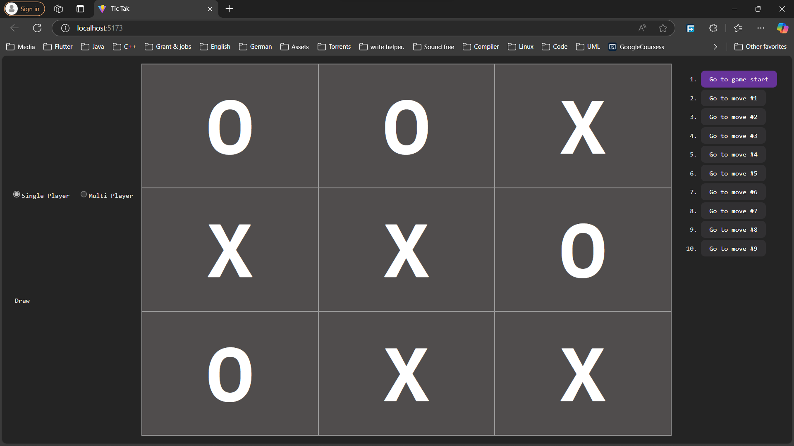

# Tic-Tac-Toe Game

A simple yet engaging Tic-Tac-Toe game built with **React**, **TypeScript**, and **Zustand** for state management. Play against a friend in **multiplayer mode** or challenge the AI in **single-player mode**!

 <!-- Add a screenshot if available -->
 <!-- Add a screenshot if available -->

---

## Features

- **Two Game Modes**:
  - **Single Player**: Play against an AI opponent.
  - **Multi Player**: Play against a friend on the same device.
- **AI Opponent**:
  - Uses the **Minimax algorithm** to make optimal moves.
- **Interactive UI**:
  - Clean and responsive design.
  - Displays the current game status (e.g., "Next player: X", "Winner: O", or "Draw").
- **Move History**:
  - Track and revisit previous moves.
- **Customizable**:
  - Easily extendable to add new features or improve the AI.

---

## Technologies Used

- **React**: A JavaScript library for building user interfaces.
- **TypeScript**: Adds static typing to JavaScript for better code quality.
- **Zustand**: A lightweight state management library for React.
- **CSS**: Styling for the game board and UI components.

---

## Getting Started

Follow these steps to set up and run the game on your local machine.

### Prerequisites

- **Node.js**: Make sure you have Node.js installed. Download it from [nodejs.org](https://nodejs.org/).

### Installation

1. **Clone the repository**:
   ```bash
   git clone https://github.com/your-username/tic-tac-toe.git
   cd tic-tac-toe
   ```
2. **Install dependencies**:

   ```bash
   npm install
   ```

3. **Run the development server**:

   ```bash
   npm start
   ```

4. **Open the game**:

   ```bash
   Visit http://localhost:3000 in your browser to play the game
   ```

## How to Play

- Choose Game Mode:
  Select Single Player to play against the AI or Multi Player to play with a friend.

- Make Your Move:
  Click on an empty square to place your mark (X or O).
- Win the Game:
  Be the first to get three of your marks in a row (horizontally, vertically, or diagonally).
- View Move History:
  Use the move history panel to revisit previous moves.

## Folder Structure

<pre>
tic-tac-toe/  
  ├── src/ 
  │   ├── Game/
  │       ├── Components/
  │           ├── Board.tsx                  # Renders the Tic-Tac-Toe game board and handles square clicks
  │           ├── MoveHistory.tsx            # Displays the history of moves and allows navigation to previous states
  │           ├── Square.tsx                 # Represents an individual square on the board
  │       ├── ai.ts                          # Contains AI logic for single-player mode (e.g., minimax algorithm)
  │       ├── Game.tsx                       # Main game component that manages the game flow and state
  │       ├── Menu.tsx                       # Renders the game menu (e.g., player vs player, player vs AI)
  │       ├── useGameStore.tsx               # Zustand store for managing global game state (e.g., board, turn, winner)
  │       ├── utils.tsx                      # Utility functions (e.g., check for winner, calculate AI moves)
  │   ├── App.tsx                            # Main application component that renders the game and other UI
  │   └── index.tsx                          # Entry point of the application, renders the App component
  ├── public/                                # Contains static assets (e.g., images, icons, favicon)
  ├── package.json                           # Lists project dependencies and scripts for running the app
  └── README.md                              # Project documentation, including setup instructions and usage
</pre>

## Customization

### Add New Features

- Difficulty Levels:

  - Extend the AI logic to include easy, medium, and hard difficulty levels.

- Online Multiplayer:

  - Integrate a backend to allow players to compete online.

- Themes:

  - Add light and dark mode support.

- Improve the AI:

  - The AI currently uses the Minimax algorithm. You can enhance it by:

- Adding alpha-beta pruning for better performance.

- Implementing a heuristic evaluation function for faster decision-making.

### Contributing

- Contributions are welcome! If you'd like to contribute to this project, please follow these steps:
  - Fork the repository.
  - Create a new branch for your feature or bugfix.
  - Commit your changes.
  - Submit a pull request.

### License
- This project is licensed under the MIT License. See the LICENSE file for details.

### Acknowledgments

- Inspired by the classic Tic-Tac-Toe game.
- Built with ❤️ using React, TypeScript, and Zustand.
